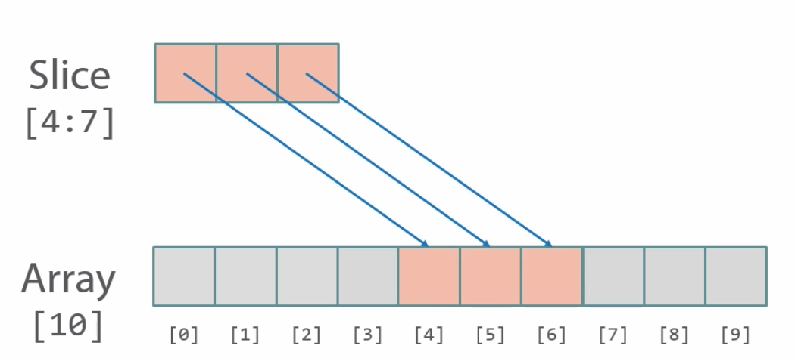
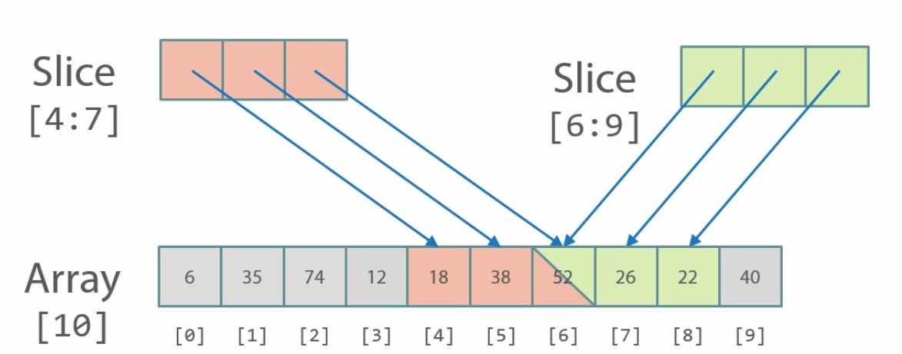
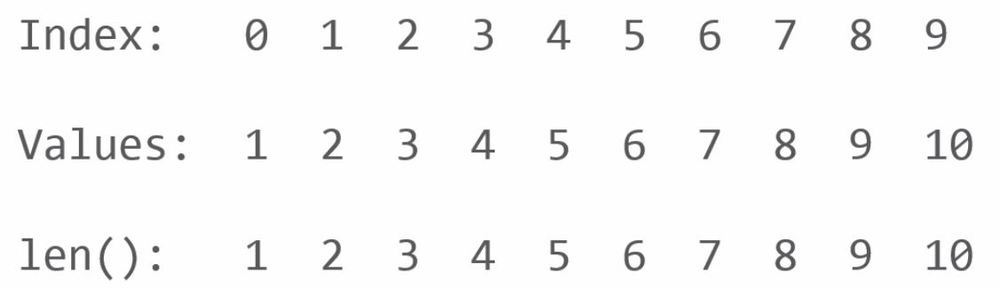
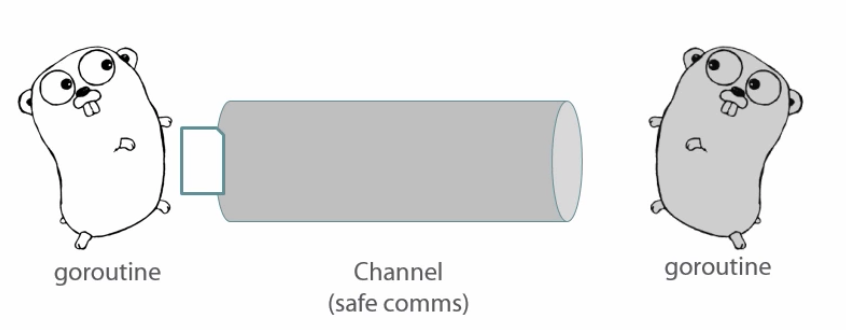
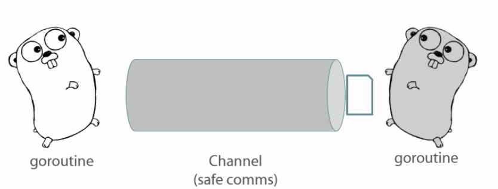

<!-- START doctoc generated TOC please keep comment here to allow auto update -->
<!-- DON'T EDIT THIS SECTION, INSTEAD RE-RUN doctoc TO UPDATE -->
**Table of Contents**  *generated with [DocToc](https://github.com/thlorenz/doctoc)*

- [Go Fundamentals](#go-fundamentals)
  - [Hello World](#hello-world)
    - [Setting up Workspace](#setting-up-workspace)
    - [First Program](#first-program)
    - [Functions Primer](#functions-primer)
    - [Printing to screen](#printing-to-screen)
    - [Running program](#running-program)
    - [More detail](#more-detail)
  - [Variables and Constants](#variables-and-constants)
    - [Declaring at the Package Level](#declaring-at-the-package-level)
    - [Determining Types](#determining-types)
    - [Short Assignment](#short-assignment)
    - [Pointers](#pointers)
    - [Passing by Value](#passing-by-value)
    - [Passing by Reference](#passing-by-reference)
    - [Constants](#constants)
    - [Accessing Environment Variables](#accessing-environment-variables)
  - [Functions](#functions)
    - [Go Function Syntax](#go-function-syntax)
    - [Function Basics](#function-basics)
    - [Variadic Functions](#variadic-functions)
  - [Conditionals](#conditionals)
    - [if Syntax](#if-syntax)
    - [Simple Initialization Statements](#simple-initialization-statements)
    - [Switch Syntax](#switch-syntax)
    - [Breaking and Fall-through](#breaking-and-fall-through)
    - [The Role of if in Error Handling](#the-role-of-if-in-error-handling)
  - [Loops](#loops)
    - [for Syntax](#for-syntax)
    - [for ... range](#for--range)
    - [Break and Continue](#break-and-continue)
  - [Arrays and Slices](#arrays-and-slices)
    - [Arrays vs. Slices](#arrays-vs-slices)
    - [Under the Hood](#under-the-hood)
    - [append()](#append)
    - [Miscellaneous](#miscellaneous)
  - [Maps](#maps)
    - [Syntax](#syntax)
    - [Iteration and Ordering](#iteration-and-ordering)
    - [Manipulating Maps](#manipulating-maps)
    - [References and Performance](#references-and-performance)
  - [Structs](#structs)
    - [What is a Struct](#what-is-a-struct)
    - [Object Oriented Programming in Go](#object-oriented-programming-in-go)
    - [Defining a Struct](#defining-a-struct)
    - [Working with Structs](#working-with-structs)
  - [Concurrency](#concurrency)
    - [What is Concurrency](#what-is-concurrency)
    - [What is a Concurrent Program](#what-is-a-concurrent-program)
    - [Concurrency In Go](#concurrency-in-go)
    - [Writing a Concurrent Go Program](#writing-a-concurrent-go-program)
    - [Channels](#channels)

<!-- END doctoc generated TOC please keep comment here to allow auto update -->

# Go Fundamentals

> Learning Go with Pluralsight [course](https://app.pluralsight.com/library/courses/go-fundamentals/table-of-contents)

## Hello World

Go encourages modular programming via small packages being composed as applications.

### Setting up Workspace

Go needs a *workspace*, root folder structure for apps. Under that need 3 sub-directories for: src, pkg, bin.

### First Program

[Example](hello/hello-world.go)

Every go program needs a *package declaration*, for example:

```go
package main
```

`main` is special. Tells compiler to compile program as a stand-alone executable, and not as a shared library. i.e. every executable needs `package main` as its first line of code.

Then must have a main function:

```go
func main() {

}
```

`func main()` is executable program's entrypoint. First function that will be run in a go executable program.

### Functions Primer

Functions are first class citizens, can be passed as args, assign to vars, etc.

Start with `func` keyword, then can name it anything, except `main` which has special meaning.

All functions have parentheses `()`, which list any arguments that get passed to function, then list any returns.

Function code written inside pair of curly braces `{}`.

Main function doesn't take any arguments and doesn't return any value. When main exits, entire program exits. If there were no errors, it returns 0 exit code to OS.

### Printing to screen

Idiomatic way is to use `fmt.println` from the format package. Therefore need to import it:

```go
package main

import "fmt"

func main() {
  fmt.Println("Hello from", runtime.GOOS)
}
```

`fmt` ships as part of the standard library.


### Running program

```shell
cd $GOPATH
cd /path/to/src
go run hello-world.go
```

Run command compiles source into executable, puts it in a temp dir and runs it.

### More detail

All go source available on github, for example, [fmt package](https://github.com/golang/go/blob/master/src/fmt/print.go).

Note that declared package name `package fmt` is the import name `import ( "fmt" )`.

Note that shared library `fmt` does not have package main or a main func.

Go is case sensitive! For the most part, all go code is written in lower case. But note function name with capital `fmt.Println`.

In order for functions in a package to be exposed, must start with capital.

Go is not whitespace sensitive but recommend spacing for legibility.

Comments are generally line comments `// this is a line comment`, even when span multiple lines, rather than block comments.

## Variables and Constants

### Declaring at the Package Level

[Example](vars/hello-vars.go)

Variables are *statically typed*. Eg, variable declared as string, its type set at compile time and can never change.

When declaring variable at package level, i.e. outside of any functions, must use `var keyword`. Go does not allow non-declaration statements at package level.

Variable names must start with underscore or letter. Name of variable goes on the left and type goes on the right.

```go
var (
	name   string  //Name of subscriber
	course string  //Name of current course
	module float64 //Current place in course
)
```

Variables of the same type can also go on the same line:

```go
var (
  name, course string
  module float64
)
```

Generally when variables are declared but not initialized in code, they will be initialized with a 0 value (0 for numeric, empty string for strings).

```go
func main() {
	fmt.Println("Name is set to", name)  //Name is set to
	fmt.Println("Course is set to", course) //Course is set to
	fmt.Println("Module is set to", module) //MOdule is seto to 0
}
```

### Determining Types

[Example](vars/hello-types.go)

Can check types with runtime reflection using `reflect` package.

```go
func main() {
	fmt.Println("Name is", name, "and is of type", reflect.TypeOf(name)) //Name is  and is of type string
	fmt.Println("Module is", module, "and is of type", reflect.TypeOf(module)) //Module is 0 and is of type float64
}
```

Can also *infer* types:

[Example](vars/infer-types.go)

```go
var (
	inferredName, inferredCourse, inferredModule = "Nigel", "Docker Deep Dive", 3.2
)

func main() {
	fmt.Println("Name is", inferredName, "and is of type", reflect.TypeOf(inferredName)) //Name is Nigel and is of type string
	fmt.Println("Module is", inferredModule, "and is of type", reflect.TypeOf(inferredModule)) //Module is 3.2 and is of type float64
}
```

For legibility, better to initialize multiple variables each on its own line.

Cannot add integer and float (type mismatch error):

```go
a := 10.0000000000
b := 3
c := a + b //invalid operation: a + b (mismatched types float64 and int)
```

But can convert float to int:

```go
a := 10.0000000000
b := 3
c := int(a) + b
fmt.Println("\nC has value:", c, "and is of type:", reflect.TypeOf(c)) //C has value: 13 and is of type: int
```

Note that `a` is still a float, calling `int(a)` does not change `a` to int.

### Short Assignment

[Example](vars/short-asg.go)

Variables declared at package level are available to all functions in the package, i.e. they're *global* in scope.

Can also declare variables within a function, then use a shorthand declare-initialize construct:

```go
func main() {
  name := "Nigel"
}
```

Shorthand only works in functions, and when declaring and initializing variables on the same line. This is idiomatic Go.

Note that a variable is declared in the shorthand notation in a function and not used, the program will not compile. Will get error like "somevar declared and not used". Whereas when variable declared at package level and not used, program will compile.

### Pointers

Go passes arguments by value, not by reference. When passing an argument to a function, Go makes a *copy* of the value being passed, places copy on the stack for use by the function. Variable itself is not placed on the stack.

**Behind the scenes**

When variable is created, Go sets aside memory for it, for eg: at memory addres `0xAA`, place a value "Docker Deep Dive".
When this variable passed as argument to a function, Go makes a copy, eg: at memory address `0xBB`, value "Docker Deep Dive".
Copy at `0xBB` is placed on stack. Achieves immutability, any changes made to var by function will only affect the copy, not the original.

To workaround this default behaviour, use *pointers*. Ampersand before variable name represents memory address (aka pointer value) rather than value of the variable. Can also create a pointer variable using ampersand.

In this example, the `ptr` variable holds the pointer value of the `module` variable. Asterisk in front of pointer variable dereferences it so we get the contents at that memory address:

```go
func main() {
	module := 3.2
	ptr := &module
	fmt.Println("Ptr is", ptr, "and is of type", reflect.TypeOf(ptr)) //Ptr is 0xc42000a2c8 and is of type *float64
	fmt.Println("Memory address of *module* variable is", ptr, "and the value of *module* is", *ptr) //Memory address of *module* variable is 0xc42000a2c8 and the value of *module* is 3.2
}
```

Summary:
* `&` references a pointer
* `*` de-references a pointer

### Passing by Value

[Example](vars/pass-by-value.go)

To demonstrate, a function to change the value of a variable:

```go
// changeCourse gets a COPY of the course variable
// course argument is a string and this function also returns a string
func changeCourse(course string) string {
  // Use = rather than := because not declaring a new variable,
  // just assigning a new value to existing variable.
	course = "First Look: Native Docker Clustering"

	fmt.Println("Trying to change your cousrse to", course)
	return course
}
```

Return values can be named or unnamed. Above is example of unnamed.

Now use the function. Note that any changes made to variable inside of function have no impact on original variable passed in.

```go
func main() {
	name := "Nigel"
	course := "Docker Deep Dive"

	fmt.Println("\nHi", name, "you're currently watching", course) // Docker Deep Dive
	changeCourse(course)
	fmt.Println("\nHi", name, "you're currently watching", course) // Still Docker Deep Dive
}
```

### Passing by Reference

[Example](vars/pass-by-ref.go)

Use pointers. `&` on variable passed in to function, and `*` on variable used within function.

```go
package main

import "fmt"

func main() {
	name := "Nigel"
	course := "Docker Deep Dive"

	fmt.Println("\nHi", name, "you're currently watching", course) // Docker Deep Dive

	// pass pointer to course variables location in memory
	changeCourse(&course)

	fmt.Println("\nHi", name, "you're currently watching", course) // First Look: Native Docker Clustering
}

// askterisk tells Go that `course` is a POINTER to a string variable
func changeCourse(course *string) string {
	// asterisk tells Go that we're assigning to location in memory that the course pointer is referencing
	*course = "First Look: Native Docker Clustering"

	fmt.Println("Trying to change your cousrse to", *course)
	return *course
}
```

### Constants

Constants are immutable, once assigned a value, can never change. Declared with `const` keyword, but cannot use shorthand `:=` notation.

```go
const speedOfLightMph = 186000
```

### Accessing Environment Variables

[Example](vars/env-vars.go)

Use `os` package for access to various operating system stuff, including environment variables.

Print out all environment variables with their values, one per line:

```go
for _, env := range os.Environ() {
  fmt.Println(env)
}
```

Get an environment variable by key and use it:

```go
name := os.Getenv("USER")
fmt.Println("Hello", name)
```

## Functions

### Go Function Syntax

Start with `func` keyword, followed by name of function, then parentheses. Any code executed inside of function goes in pair of curly braces.

Function parameters are specified inside the parentheses. Includes parameter name and its type. `func` line is called *function signature*. Multiple parameters separated by commas.

Return type also defined in function signature, after the parens but before the curly braces. Multiple return values must be enclosed in parens.

Use `return` keyword to return a value back to caller.

```go
func titleCase(text string) string {
  <code>
  return convertedText
}
```

`main` function is special
* gets called automatically
* does not take any input parameters
* does not return any values

### Function Basics

[Example](functions/func-basics.go)

### Variadic Functions

[Example](functions/variadic.go)

Used when don't know how many values will be passed to a function. Use ellipsis `...` before the type:

```go
func bestLeageFinishes(finishes ...int) {

}
```

Values passed into the function get made into a slice of ints:

```go
bestFinish := bestLeagueFinishes(13, 10, 13, 17, 14, 16)
```

Slice is a list, in above example with 6 entries:

0: 13
1: 10
2: 13
3: 17
4: 14
5: 16

Given a slice, can loop over it using `range`:

```go
for _, f := range finishes {
  // do something with value f
}
```

## Conditionals

### if Syntax

[Example](conditionals/if-syntax.go)

Works exactly the same as other languages. Evaluate a condition, if it's true branch one way, otherwise the other way.

However, in Go, condition to evaluate **must evaluate to a Boolean expression**. Cannot use integers or strings. Strict approach keeps things clean.

**Boolean Comparison Operators**

`==` Equal to

`!=` Not equal to

`<` Less than

`<=` Less than or equal to

`>` Greater than

`>=` Greater than or qual to

`&&` AND

`||` OR

Anatomy of `if`. Note curly brace *MUST be on same line* as `if` expression. Because of how compiler inserts semicolons at end of each line. You don't type those in yourself, compiler inserts them.

Can also use `else if` and `else`:

```go
if <Boolean expression> {
  <code block>
} else if <Boolean expression> {
  <code block>
} else {
  <code block>
}
```

If first `if` condition evaluates to true, the code jumps out of the entire `if` block, the subsequent `else if` and `else` statements will not be evaluated.

Can have multiple `else if`'s but only a single `else` and must be the last statement.

`if` statements can also be nested.

### Simple Initialization Statements

[Example](conditionals/if-syntax.go)

These are optional and execute before the Boolean expression is evaluated.

```go
if <simple statement> ; <Boolean expression> {
  <code block>
}
```

Idiomatic go is to use this to initialize variables that will be used in the if block.

Variables declared in the initialization statement are *scoped* to the `if` statement. When code finishes the `if` statement, these vars are out of scope and will be garbage collected.

### Switch Syntax

Both `simple statement` and `expression` are optional. But if do use `simple statement`, then following `;` is *mandatory*, even if no `expression` follows.

Variables declared in `simple statement` are only scoped to the `switch` block.

```go
switch <simple statement> ; <expression> {
case <expression>: <code>
case <expression>: <code>
...
default: <code>
}
```

`default` block executes if no matches in any of the `case` statements. Lexically it doesn't have to be the last option but more readable to have it at the bottom.

Expression could be a string, eg:

```go
switch "Docker Deep Dive" {
case "Docker Deep Dive": <code block will execute>
case "Go Fundamentals": <code block will NOT execute>
default: <code block also will not execute>
}
```

`switch` type and `case` type must be the same in order for them to be comparable.

After match is found, `switch` block is exited and code continues executing after the curly brace closing the `switch` block. Unlike other languages that have *implicit fallthrough*, after match is found, all cases below it also get executed. This does not happen with Go.

### Breaking and Fall-through

[Example](conditionals/fallthrough.go)

Each `case` statement has an implicit `break`. But if want fallthrough behaviour, just add `fallthrough` keyword as last line in case statement.

The following will output "Here are some recommended Docker Courses" AND "Here are some recommended Windows courses":

```go
topic := "docker"

switch topic {
case "linux":
  fmt.Println("Here are some recommended Linux courses...")
case "docker":
  fmt.Println("Here are some recommended Docker courses...")
  fallthrough
case "windows":
  fmt.Println("Here are some recommended Windows courses...")
default:
  fmt.Println("Sorry we couldn't find a match, " +
    " why not try out Top 100 list!")
}
```

`fallthrough` only applies on a case by case basis. If want them all to fallthrough, must specify the `falthrough` keyword on all of them.

However, idiomatic GO is not to use `fallthrough`, but to make multiple matches in the same `case` statement using a comma separted list:

```go
switch tmpNum := random(); tmpNum {
case 0, 2, 4, 6, 8:
  fmt.Println("We got an even number -", tmpNum)
case 1, 3, 5, 7, 9:
  fmt.Println("We got an odd number -", tmpNum)
}
```

[Full example](conditionals/not-fallthrough.go).

### The Role of if in Error Handling

[Example](conditionals/error-handling.go)

Idiomatic to return an `error` as the last return from functions and methods. For example a function with two return values that tests connectivity to a host. Note that `error` is a standard type defined in Go:

```go
func testConn(target string) (respTime float 64 err error) {
  ...
}
```

If all went well in the function, it should return `nil` for the value of `err`. Otherwise, it should be not `nil`. i.e. `nil` is used to indicate success.

Idiomatic Go is to *always* check the value of returned errors:

```go
if err != nil {
  <error handling code>
}
<code...>
```

## Loops

### for Syntax

[Example]

`expression` can be a Boolean (eg: `i < 10`) or a range. Can also be blank (which Go assumes to be `true`), which generates an infinite loop.

```go
for <expression> {
  <code>
}
```

Example using range. Range takes a list (either slice or a map) and iterates over the list. In every loop iteration, the current value of `courseList` is assigned to the variable `i`:

```go
for i := range courseList {
  <code>
}
```

For loop can be given simple pre and post expressions. eg:

```go
for i := 0; i < 10; i++ {
  <code>
}
```

pre: declare and initialize `i` to 0
boolean: test for `i` less than 10
post: increment `i` by one

Variables declared in pre statement only available within scope of for loop.

Pre statement runs only once, before first execution of loop, before evaluating expression.

Post statement runs at end of every iteration through the loop.

### for ... range

[Example](loops/for-range.go)

```go
// declare and define a list of courses,
// technically, its a "slice": unordered numbered list of items
// behind the scenes, its a reference to an array
coursesInProg := []string{"Docker Deep Dive", "Docker Clustering", "Docker and Kubernetes"}

for _, i := range coursesInProg {
  fmt.Println(i)
}
```

Prints out:

```
Docker Deep Dive
Docker Clustering
Docker and Kubernetes
```

Range goes over each item in a slice, one value at a time until it gets to end of slice. One element *per iteration of loop*.

With slices, `range` returns 2 values for each iteration: 1) index value (not used in above example that's why `_` is used to assign index to it, indicating its ignored), and 2) data value. In above example, data value is assigned to `i` variable.

Loops can also be nested.

### Break and Continue

`break` can be used to break out of current loop. With nested loops, breaks out of *current* loop.

```go
for <expr...> {
  <code>
  for <expr...> {
    <code>
    for <expr...> {
      <code>
      break //breaks out of inner loop and back into middle loop
    }//inner loop
  }//middle loop
}//outer loop
```

To break out of any arbitrary loop, for example, from inner `break`, want to go out to outer loop, use `label` (note label name is arbitrary):

```go
for <expr...> {
  <code>
myBreakpoint
  for <expr...> {
    <code>
    for <expr...> {
      <code>
      break myBreakPoint
      }//inner loop
      }//middle loop
      }//outer loop
code
```

If a label is defined, you *must* use it, otherwise won't compile.

**Continue**

When `continue` is encountered in a loop, normal execution is interrupted, and control passes back *immediately* to top of loop.

```go
for timer := 10; timer >=0; timer-- {
  // if timer value is an even number,
  // stop here and resume execution at top of loop
  if timer % 2 == 0 {
    continue
  }
  fmt.Println(timer)
  time.Sleep(1 * time.Second)
}
```

Above will only print the odd numbers to the screen, because the println and sleep statements are skipped for even numbers.

## Arrays and Slices

### Arrays vs. Slices

[Example](array-slice/arr-slice-syntax.go)

Go's handling of Arrays and Slices is different than other languages. Arrays and slices refer to *numbered* lists containing elements of the *same type*.

Slices are almost always used in Go rather than arrays. But slices are "connected" to arrays.

Array has static/fixed length.

Slices look and feel just like arrays but have variable/flexible length. Can be resized by simply appending a value to the end. Can also create a shorter version by creating a `slice` of it.

Slices must be built on top of an array. Elements in slice must be from contiguous elements in array.



Slices are variables that are *references* to array. No actual data is stored in the slice.

Elements in slice are pointers to the real values stored in the array. Only thing stored in slice is (aka slice header):

* name
* type
* starting offset in underlying array
* length (flexible, can't be longer than underlying array)
* capacity? (optional)

Can have multiple slices pointing to same array.



Changing value in a slice will change value in underlying array. i.e. all other slices will also see that change.

Since slices are references, when they get passed into functions, they *effectively* get passed by reference.

The slice header is copied by value to the function.

To create a slice, use built-in `make` function, which takes up to 3 values:

```go
mySlice := make(<type>, <len>, <cap>)
```

**Length vs Capacity**

Capacity specifies *maximum* size of slice, which is size of array that will back the slice. Any time a slice is created, Go also creates a hidden array to store the data from the slice.

Square brackets with no number inside indicate that a slice is being created. `string` afterwards indicates its a slice of strings. For example

```go
myCourses := make([]string, 5, 10)
```

Using `make` can declare slice, but not initialize in same line. Hidden array created by `make` gets initialized with zero values (empty strings for `string` type). In above example, length of hidden array is 10.

Using `make` command, capacity is optional. In this case hidden array will have capacity that is same as declared length of slice (5 in example below):

```go
myCourses :=make([]string, 5)
```

Can also declare and initialize array on one line using shorthand:

```go
myCourses := []string("Docker", "Puppet", "Python ")
```

Above creates new slice of strings, with length and capacity of 3.

### Under the Hood

[Example](array-slice/slice.go)

Slices indexed from 0:

```go
mySlice := []int{1, 2, 3, 4, 5, 6, 7, 8, 9, 10}
fmt.Println(mySlice[4]) //prints 5
```

But length and capacity start at 1.



Index position can be used to change:

```go
mySlice[1] = 0
```

To get a smaller slice:

```go
sliceOfSlice := mySlice[2:5]
```

Returns a new slice with values of original slice at index positions 2 through 4 inclusive. i.e. left hand operator is inclusive and right hand operator is exclusive.

When creating a slice, if no value specified before colon operator, then index value 0 is implied

```go
sliceOfSlice := mySlice[:5] // same as if had specified mySlice[0:5]
```

Same with other side `[5:]`, then last position of underlying array is inferred (i.e. length of array - 1).

### append()

[Example](array-slice/append.go)

Benefit of slices over arrays is flexibility. Use built-in `append` function to add an element to slice.

If call append after array capacity is full, go will create a new array twice the size of original and copy the values over:

```go
mySlice := make([]int, 1, 4)
fmt.Printf("\nCapacity is %d", cap(mySlice))

for i := 1; i < 17; i++ {
  mySlice = append(mySlice, i)
  fmt.Printf("\nCapacity is %d", cap(mySlice))
}
```

Output:

```
Capacity is 4
Capacity is 4
Capacity is 4
Capacity is 4
Capacity is 8
Capacity is 8
Capacity is 8
Capacity is 8
Capacity is 16
Capacity is 16
Capacity is 16
Capacity is 16
Capacity is 16
Capacity is 16
Capacity is 16
Capacity is 16
Capacity is 32
```

### Miscellaneous

Referencing a slice variable references the *entire* slice, not just the first value.

```go
mySlice := []int{1, 2, 3, 4, 5}
fmt.Println(myslice) // [1, 2, 3, 4, 5]

for _, i := range mySlice {
  fmt.Println("for range loop:", i) // for range loop: 1, for range loop: 2, etc.
}
```

Slices can be iterated for `for... range` loops, which returns two values, index position, and data value. Index position can be ignored by assigning it to underscore variable.

Slices can be appended to other slices using ellipses, i.e. appending more values to a slice of a type that the slice currently holds.

```go
mySlice := []int{1, 2, 3, 4, 5}
newSlice := []int{10, 20, 30}
mySlice = append(mySlice, newSlice...)
```

This doesn't append `newSlice`, but rather appends the *elements* of `newSlice` to `mySlice`.

Can also create multi-dimensional slices, just add slices as elements within a slice. Each slice within a multi-dimensional slice can be of a different length.

## Maps

Similar to arrays and slices in that they're lists. But they're *unordered*. Go randomizes starting offset when accessing maps.

Maps are list of `<key>:<value>` pairs.

Can append, update, and remove entries from maps.

Maps are reference types (like slices).

All keys in a map must be unique.

### Syntax

[Example](maps/map-syntax.go)

Must declare both key type and value type when creating map.

Key type must be *comparable* type, i.e. a type that can be compared using `==` or `!=` boolean operators. (eg: bools, strings, numeric types, and any other type that is composed of those types, but not slices).

```go
map[keyType]valueType
```

Can use built in `make` function to build a map. Eg, make a map of string keys and int values:

```go
leageTitles := make(map[string]int)
// add some values
leageTitles["Sunderland"] = 6
leageTitles["Newcastle"] = 4
```

Can also declare and initialize maps in one line using composite literal form:

```go
recentHead2Head := map[string]int {
  "Sunderland": 5,
  "Newcastle": 0
}
```

### Iteration and Ordering

[Example](maps/map-iter.go)

Use `range` to iterate over a map, returns two values the key of the current map entry, and the value in the map at that key.

```go
testMap := map[string]int{"A": 1, "B": 2, "C": 3, "D": 4, "E": 5}
for key, value := range testMap {
  fmt.Printf("Key is: %v Value is : %v\n", key, value)
}
```

Outputs:

```
Key is: A Value is : 1
Key is: B Value is : 2
Key is: C Value is : 3
Key is: D Value is : 4
Key is: E Value is : 5
```

**IMPORTANT:**
Do not depend on key order, if run the program several times, notice output changes, because Go uses a random starting offset. eg:

```
Key is: B Value is : 2
Key is: C Value is : 3
Key is: D Value is : 4
Key is: E Value is : 5
Key is: A Value is : 1
```

### Manipulating Maps

[Example](maps/map-manipulate.go)

Items in map referenced the same way as slices, using `[]` notation.

```go
testMap := map[string]int{"A": 1, "B": 2, "C": 3, "D": 4, "E": 5}
fmt.Println(testMap["C"]) // 3
```

To update an existing value in the map:

```go
testMap["A"] = 100
fmt.Println(testMap) // map[A:100 B:2 C:3 D:4 E:5]
```

To insert a value in the map, use same syntax as update:

```go
testMap["F"] = 6
fmt.Println(testMap) // [D:4 E:5 F:6 A:100 B:2 C:3]
```

When using `someMap["somekey"] = someVal` syntax, if `someKey` is already a key in the map, its associated data value will be updated to `someVal`, otherwise, `someKey` will be inserted into `someMap` with a value of `someVal`.

To delete an item from a map, use `delete` built-in function, passing in name of map and key to be deleted, will delete key and value:

```go
delete(testMap, "F")
fmt.Println(testMap) // map[B:2 C:3 D:4 E:5 A:100]
```

### References and Performance

Maps are *reference types*, ie. maps get passed by reference rather than by value to functions. Go does NOT make a separate copy of the maps values and place a copy of the values on the call stack. Therefore any changes made to map are visible to caller and any other functions that use the map.

Maps are NOT safe for concurrency, because its undefined what happens if two different processes read and write to the same map at the same time.

Passing maps is cheap because its just pointers being passed rather than actual data.

Good practice to specify size of map when defining it. Not mandatory but can improve performance for large maps:

```go
myMap := make(map[<keyType]<valueType>, size)
```

Go can increment size of maps as needed in the background but there is overhead associated with that.

## Structs

### What is a Struct

Allow defining custom data types. Use when built-in types are not ideal or expressive enough.
A collection of named fields, where each field is of a specific type.

Example, working with geometric shapes. This defines a new type but does not instantiate any new variables:

```go
type Circle struct {
  radius float64
  diameter float64
  circumference float64
}
```

Now when need to work with a circle, can create a new variable and make its type the `Circle` type.

### Object Oriented Programming in Go

OO languages have Objects, Classes, Inheritance.

Go does not have an `Object` type. `struct` is as close as it gets in that they have named fields and can even have methods, but they don't support inheritance. Also does not have `Class` keyword.

Can do some forms of OOP with Go but its not the best suited for that style of programming.

### Defining a Struct

[Example](structs/define-struct.go)

Given a struct as follows:

```go
type courseMeta struct {
  Author string
  Level  string
  Rating float64
}
```

Can declare a variable of that type:

```go
var DockerDeepDive courseMeta
```

Or use `new` keyword. Note that this way gives a pointer:

```go
DockerDeepDive := new(courseMeta)
```

Either of the above ways initializes all the fields in the struct with zero values.

Can also use composite literal. If know the order of fields defined in struct, could leave them off here:

```go
DockerDeepDive := courseMeta{
  Author: "Nigel Poulton",
  Level: "Intermediate",
  Rating: 5,
}
fmt.Println(DockerDeepDive) // {Nigel Poulton Intermediate 5}
```

### Working with Structs

[Example](structs/working-struct.go)

Access individual fields of a struct using dot `.` operator:

```go
fmt.Println("\nDocker Deep Dive author is:", DockerDeepDive.Author) // fmt.Println("\nDocker Deep Dive author is:", DockerDeepDive.Author)
```

Change a field:

```go
DockerDeepDive.Rating = 1
fmt.Println("\nDocker Deep Dive rating is:", DockerDeepDive.Rating) // Docker Deep Dive rating is: 1
```

## Concurrency

### What is Concurrency

Creating multiple processes that execute *independently* (which does not mean simultaneously).

"...concurrency is the *composition* of independently executing rocesses, while parallelism is the simultaneous *execution* of (possibly related) computations. Concurrency is about *dealing with* lots of things at once. Parallelism is about *doing* lots of things at once." --Rob Pike

### What is a Concurrent Program

Assume a cpu with single core. When a program (application) is run, OS creates a *process*, which is the run-time instance of the program. Process keeps track of programs memory, file handles etc. Process starts with single *thread*. Thread is what actually runs on the processor core and executes the program.

Every program starts with a single main thread, which can launch many more threads. OS schedules threads against processor cores.

Threads are how concurrency and parallelism are achieved. For parallelism, need more cores so that a thread can run on each core in parallel.

For concurrency, with a single core... Go doesn't use threads for concurrency (they're resource heavy and complicated).

### Concurrency In Go

Go's concurrency model does use threads under the hood, but concurrency action happens via lightweight abstractin layered on top of threads - goroutine. Goroutine's not scheduled by OS, scheduled by the Go runtime.

**goroutines vs OS Threads**

* goroutines are lightweight compared to traditional thread (eg: stacksize 1M vs single-digit kb)
* OS schedules threads whereas Go runtime manages goroutines (creating, tearing down, etc), less complexity for programmer having the runtime deal with it
* OS threads - switches expensive, still expensive with Go switching but the way goroutines layered on top of threads results in fewer switches
* When goroutine blocks (eg: waiting on network or disk I/O, sleeping etc.), Go runtime swaps it out for another goroutine running on the *same thread*. There is some overhead but way less than using OS to schedule a new thread.
* goroutines have faster start-up times
* Due to *channels* goroutines can easily/safely communicate with eachother

**Go's concurrency model**

Actor model.

Communicating Sequential Processes (CSP).

Actors safely pass messages between each other via *channels*.

goroutine's are the actors.

Channels are like pipes - one goroutine puts data onto a channel and another goroutine retrieves it off the channel.





### Writing a Concurrent Go Program

[Example](concurrency/concurrent-example.go)

Simply add `go` keyword in front of function to convert it to a go routine, which makes it run concurrently:

```go
func main() {

	// self-executing anonymous function
	go func() {
		// this will put ENTIRE PROGRAM to sleep for 5 seconds (if not using goroutine)
		time.Sleep(5 * time.Second)
		fmt.Println("Hello")
	}()

	// self-executing anonymous function
	go func() {
		fmt.Println("Pluralsight")
	}()
}
```

When execution reaches first `go` statement, makes a goroutine of that function and starts running it. When it hits `time.Sleep`, does not block entire program, but just that goroutine.

Then next anonymous function, which is also a goroutine will get switched on to the thread in the first one's case.

Think of `main` as a goroutine even though its not really. As soon as `main` exits, entire program exits, including all goroutines. So in above example, `main` will exit before either of the two anonymous function goroutines get a chance to execute.

Solution is to use `WaitGroup` from `sync` package so that goroutines can tell `main` when they're done. Then main uses WaitGroup to wait.

```go
func main() {

	var waitGrp sync.WaitGroup
	waitGrp.Add(2)

	// self-executing anonymous function
	go func() {
		defer waitGrp.Done()

		// this will put ENTIRE PROGRAM to sleep for 5 seconds (if not using goroutine)
		time.Sleep(5 * time.Second)
		fmt.Println("Hello")
	}()

	// self-executing anonymous function
	go func() {
		defer waitGrp.Done()

		fmt.Println("Pluralsight")
	}()

	waitGrp.Wait()
}
```

With above changes, output is:

```
Pluralsight // then 5 seconds waiting
Hello
```

### Channels
